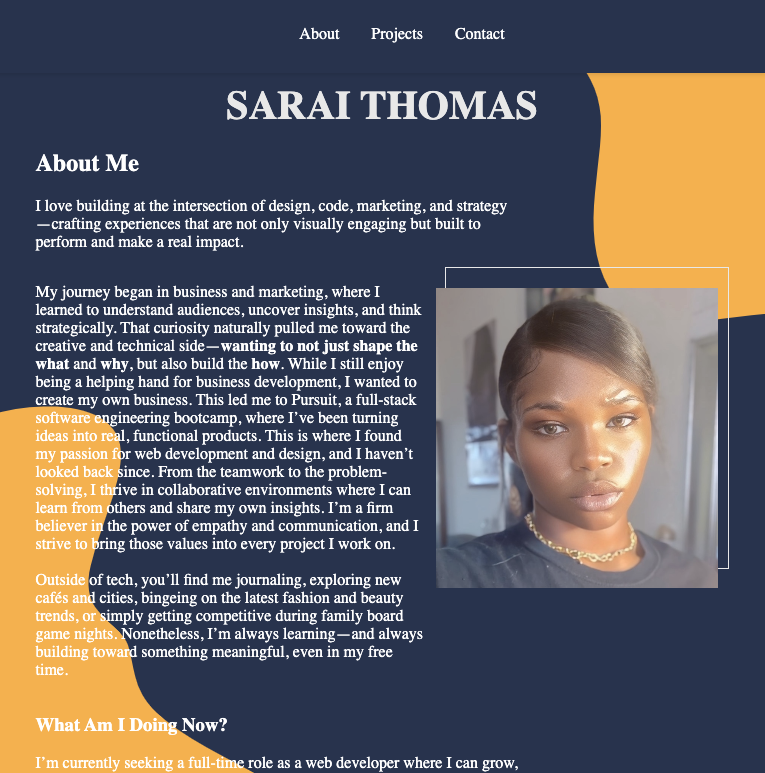
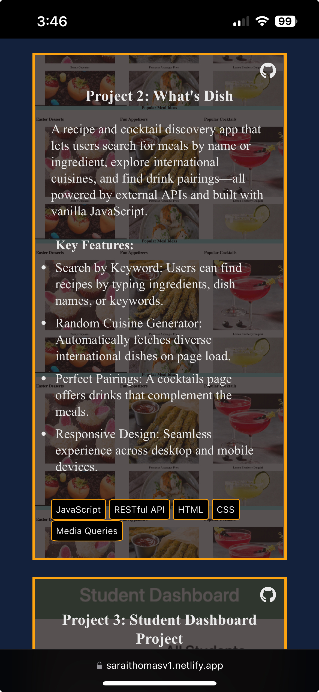

# 💻 Portfolio Website — Week 1 Project

## 🚀 Overview

This is my personal portfolio website built with **HTML** and **CSS**. It serves as a foundation for showcasing my skills and projects as I grow through the program and beyond.

The project focuses on:
- Writing clean, semantic HTML
- Styling using organized CSS
- Practicing Git/GitHub workflows
- Deploying a live, responsive website

## 🌐 Live Site

👉 [View My Portfolio](https://saraithomasv1.netlify.app)

## 🙋‍♀️ About Me

Hi! I'm Sarai Thomas, an aspiring developer passionate about creativity, technology, and storytelling. My background includes:

- 💎 Running a custom jewelry brand (GLD RZE)
- ✍️ Content creation and digital marketing
- 🎨 Visual arts and design
- 👩‍💻 Learning full-stack development

## 🧩 Sections

- **Home**: Hero banner with my name and intro message
- **About Me**: Background, interests, and skill highlights
- **Projects**: Placeholder for future web and mobile projects
- **Contact**: Email form styled for mobile and desktop

## 📁 File Structure
portfolio-site/
├── index.html
├── styles/
│ └── main.css
└── README.md

## 🧪 Tech & Tools

- HTML5, CSS3 (Flexbox + Media Queries)
- Google Fonts
- Netlify for deployment
- Git & GitHub for version control

## 📋 Checklist

- [x] Responsive design for mobile and desktop
- [x] Semantic HTML
- [x] Clean, organized CSS
- [x] Multiple commits and a proper PR
- [x] Live site linked in README
- [x] Contact form styled and present

## 📸 Screenshot

## 🗒 Instructor Notes

This project kickstarts my professional online presence and gives me a foundation to build upon. I’ll continue to iterate on this portfolio as I complete more projects and sharpen my development skills.

---

### ✨ Let's connect!

📬 [Email Me](mailto:thomas.a.sarai@gmail.com)